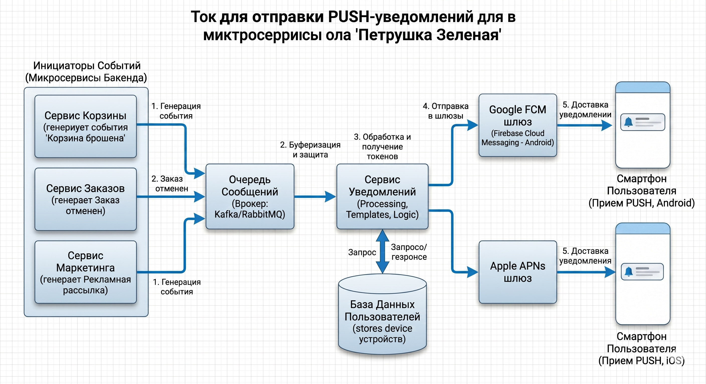

## Задание 1: Анализ требований

### 1.1 Логические противоречия и недочёты ТЗ

> **А — Конфликт 2 и 9**
> П. 2 утверждает, что минимальное количество товара в корзине — 1 единица, а удаление происходит через отдельную кнопку. П. 9 говорит, что при уменьшении до 0 товар удаляется сам. Два взаимоисключающих механизма удаления.

> **Б — Конфликт 7 и 13**
> П. 7 фиксирует цену в момент добавления навсегда. П. 13 требует автоматически обновлять цену при изменении в каталоге. Взаимоисключающие условия.

> **В — Дублирование 3 и 5**
> П. 3 ограничивает число различных позиций (≤ 5 разных товаров). П. 5 просто повторяет, что товары могут быть разными. П. 5 избыточен.

> **Г — Неоднозначность 6**
> Сообщение «Лимит корзины превышен» не указывает, какой именно лимит нарушен: по числу позиций, по количеству одного товара или по суммарному количеству. Пользователь не поймёт, что исправить.

> **Д — Неточность 11**
> Понятия «утро» и «вечер» субъективны. Без конкретных временных диапазонов невозможно корректно реализовать расписание рекламы.
---

### 1.2 Исправленный Use Case

#### Лимиты

1. Пользователь может добавить в корзину от **1 до 10 единиц** одной товарной позиции.
2. В корзине может одновременно находиться **не более 5 различных** товарных позиций.
3. Суммарное количество всех единиц товаров в корзине **не может превышать 20 штук**.

#### Управление количеством

4. Изменение количества товара осуществляется с помощью селектора:
   - Минимальное значение — **1 единица**.
   - При попытке уменьшить ниже 1 действие блокируется или запрашивается подтверждение удаления.
   - Для полного удаления позиции используется отдельная кнопка **«Удалить»**.

#### Уведомления о лимитах

5. Если действие приводит к нарушению лимита, товар не добавляется и отображается контекстное сообщение:
   - `«Нельзя добавить более 10 единиц одного товара»`
   - `«В корзине не может быть более 5 разных товаров»`
   - `«Общее количество товаров в корзине не может превышать 20 шт.»`

#### Ценообразование

6. Цена синхронизируется с каталогом в **режиме реального времени** вплоть до перехода на экран оформления заказа. В момент инициации оформления цена **фиксируется**.

#### Отображение

7. На экране корзины отображается: список товаров, изображение, количество единиц, цена за единицу, общая стоимость позиции и итоговая сумма корзины.

#### Реклама

8. В корзине предусмотрено место под рекламный баннер. Отображение регулируется планировщиком:
   - Дни: **понедельник–пятница**.
   - Утренний слот: **08:00–11:00** по местному времени пользователя.
   - Вечерний слот: **18:00–21:00** по местному времени пользователя.
   - В остальное время рекламный блок скрывается.

---

### 1.3 Уточняющие вопросы к продукт-менеджеру

- Какая бизнес-модель проекта? Монетизация за счёт рекламы, партнёрских комиссий или прямых продаж?
- Каков срок жизни корзины у неавторизованных пользователей?
- Нужно ли уведомлять пользователя, если цена в корзине снизилась?
- Нужна ли история корзины / возможность восстановить удалённые товары?

---

## Задание 2: Проектирование API

### 2.1 Эндпоинт: список партнёров по доставке

| Параметр        | Значение                                             |
|-----------------|------------------------------------------------------|
| **Метод**       | `GET`                                                |
| **Эндпоинт**    | `/api/v1/delivery/partners`                          |
| **Query-param** | `address_id` (string, UUID) — ID адреса из профиля   |

---

### 2.2 Пример запроса

```http
GET /api/v1/delivery/partners?address_id=123
Host: petrushka.ru
Authorization: Bearer <токен_пользователя>
```

---

### 2.3 Пример ответа

```json
[
  {
    "id": 1,
    "name": "METRO",
    "logo_url": "https://petrushka.ru/logos/metro.png",
    "delivery_status": "Ближайшая доставка сегодня 21:00–23:00",
    "external_url": "https://metro.ru/petrushka-integration"
  },
  {
    "id": 2,
    "name": "Ашан",
    "logo_url": "https://petrushka.ru/logos/auchan.png",
    "delivery_status": "Ближайшая доставка сегодня 18:00–20:00",
    "external_url": "https://auchan.ru"
  },
  {
    "id": 3,
    "name": "ВкусВилл",
    "logo_url": "https://petrushka.ru/logos/vkusvill.png",
    "delivery_status": "Быстрая доставка от 20 до 60 минут",
    "external_url": "https://vkusvill.ru"
  },
  {
    "id": 4,
    "name": "ВИКТОРИЯ",
    "logo_url": "https://petrushka.ru/logos/victoria.png",
    "delivery_status": "Ближайшая доставка сегодня 17:00–19:00",
    "external_url": "https://victoria-group.ru"
  }
]
```
---
## Задание 3 
